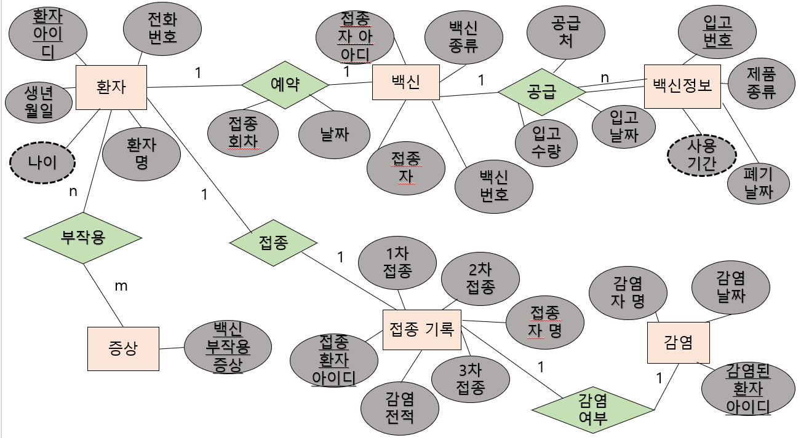

### 2022_DB_Project

### 프로젝트 주제
백신 접종 관리      
    
### 프로젝트 내용
사람들이 백신을 언제 접종하고, 어떤 종류를 접종하고, 몇 차까지 접종하고, 백신 부작용 증상이 있었는지, 코로나 감염 여부가 있었는지 DB 시스템을 통해 정리하여 알려준다.    
      
### 기능
* 사람들의 간단한 개인 정보 저장
* 사람 별 접종 여부 정보 제공
* 사람 별 코로나 감염 여부 제공
* 사람 별 접종 예약 날짜 정보 제공
* 사람 별 후유증 정보 제공
* 백신 용액에 대한 정보 제공
    
### E-R 다이어그램으로 표현

     
### 키   
#### 슈퍼키
* 환자 릴레이션의 슈퍼키 : (환자아이디), (환자아이디, 전화번호), (환자아이디, 환자명)
* 백신 릴레이션의 슈퍼키 : (접종자아이디), (접종자아이디, 접종자), (백신번호), (접종자아이디, 백신번호)
* 백신 정보 릴레이션의 슈퍼키 : (입고번호), (입고번호, 입고날짜), (입고번호, 폐기날짜)
* 증상 릴레이션의 슈퍼키 : (백신부작용증상)
* 접종 기록 릴레이션의 슈퍼키 : (접종환자아이디), (접종환자아이디, 접종자명)
* 감염 릴레이션의 슈퍼키 : (감염된환자아이디), (감염된환자아이디, 감염자명)   
#### 후보키
* 환자 릴레이션의 후보키 : (환자아이디), (환자아이디, 전화번호)
* 백신 릴레이션의 후보키 : (접종자아이디)
* 백신 정보 릴레이션의 후보키 : (입고번호)
* 증상 릴레이션의 후보키 : (백신부작용증상)
* 접종 기록 릴레이션의 후보키 : (접종환자아이디)
* 감염 릴레이션의 후보키 : (감염된환자아이디)    
 #### 기본키
* 환자 릴레이션의 기본키 : (환자아이디)
* 백신 릴레이션의 기본키 : (접종자아이디)
* 백신 정보 릴레이션의 기본키 : (입고번호)
* 증상 릴레이션의 기본키 : (백신부작용증상)
* 접종 기록 릴레이션의 기본키 : (접종환자아이디)
* 감염 릴레이션의 기본키 : (감염된환자아이디)       
#### 대체키
* 환자 릴레이션의 대체키 : (환자아이디, 전화번호)       
 #### 외래키
* 백신 - (환자 릴레이션에서) 릴레이션의 외래키 : (접종아이디)
* 백신 - (백신정보 릴레이션에서) 릴레이션의 외래키 : (백신번호)
* 접종 기록 - (환자 릴레이션에서) 릴레이션의 외래키 : (접종환자아이디)
* 감염 - (환자 릴레이션에서) 릴레이션의 외래키 : (감염된환자아이디)    
              
### 요구사항 명세서        
##### (개체는 __굵게__, 속성은 ~~취소선~~, 관계는 *이탤릭체*로 나타내었습니다.)
1. 백신 접종을 하려면 __환자__ 는 ~~환자명~~, ~~환자아이디~~, ~~전화번호~~, ~~생년월일~~, ~~나이~~를 입력해야 한다.
2. 환자는 환자아이디로 식별한다.
3.  __백신__ 에 대한 ~~접종자~~, ~~접종자아이디~~, ~~백신종류~~ 정보를 유지해야 한다.
4. 백신은 백신번호로 식별한다.
5.  __백신정보__ 에 대한 ~~사용기간~~, ~~폐기날짜~~, ~~제품종류~~, ~~입고번호~~ 정보를 유지해야 한다.
6. 백신정보는 입고번호로 식별한다.
7.  __증상__ 에 대한 ~~백신부작용증상~~ 정보를 유지해야 한다.
8.  __접종기록__ 에 대한 ~~1차접종~~, ~~2차접종~~, ~~3차접종~~, ~~접종자명~~, ~~접종환자아이디~~, ~~감염전적~~ 정보를 유지해야 한다.
9. 접종기록은 접종환자아이디로 식별한다.
10.  __감염__ 에 대한 ~~감염자명~~, ~~감염된환자아이디~~, ~~감염날짜~~ 정보를 유지해야 한다.
11. 감염은 감된환자아이디로 식별한다.
12. 환자는 백신을 맞을 경우 1차부터 3차까지 한번씩 접종해야 한다.
13. 각각 제품종류의 백신을 여러 개 *공급*하지만 백신은 한 가지만 접종할 수 있다.
14. 환자는 *부작용*을 여러 개 선택할 수 있고 하나의 백신부작용증상을 여러 환자가 선택할 수 있다.
15. 환자는 백신 종류 한 가지만 *예약*하여 접종할 수 있다.
16. 환자는 백신을 *접종*하면 접종 기록에 남고 접종 기록은 환자 한 명이 1차 접종할 때 마다 기록 하나가 생긴다.
17. 접종기록에서 감염전적은 감염되었을 때 *감염여부*에 따라 O라고 표시되고 감염되지 않았을 경우 X라고 표시된다. 
18. 환자가 백신을 예약하면 예약에 대한 접종회차, 날짜 정보를 유지해야한다.
19. 백신정보가 백신을 공급하면 공급처, 입고날짜, 입고수량 정보를 유지해야한다.
           
### 릴레이션 스키마
#### 기본키는 ~~취소선~~으로 나타냈습니다.
|릴레이션 이름|속성이름|속성이름|속성이름|속성이름|속성이름|속성이름|속성이름|
|:---:|:---:|:---:|:---:|:---:|:---:|:---:|:---:|
|접종기록 릴레이션|~~접종환자아이디~~|접종자명|1차접종|2차접종|3차접종|감염전적|~~감염된환자아이디~~(외래키)|
|부작용 릴레이션|~~환자아이디~~(외래키)|~~백신부작용증상~~(외래키)|
|감염 릴레이션|~~감염된환자아이디~~|감염자명|감염날짜|
|증상 릴레이션|~~백신부작용증상~~|
|백신 릴레이션|~~접종자아이디~~|백신종류|접종자|백신번호|~~환자아이디~~(외래키)|
|백신정보 릴레이션|~~입고번호~~|제품종류|사용기간|폐기날짜|~~백신번호~~(외래키)|
       
### 물리적 스키마   
감염 테이블   
감염된환자아이디 VARCHAR(20), 널 값 허용 X, PK,   
감염자명 VARCHAR(10), 널 값 허용 X   
감염날짜 DATE, 널 값 허용 X   
   
부작용 테이블   
환자아이디 VARCHAR(20), 널 값 허용 X, PK, FK   
백신부작용증상 VARCHAR(50), 널 값 허용 X, PK, FK   
   
접종기록 테이블   
접종환자아이디 VARCHAR(20), 널 값 허용 X, PK   
접종자명 VARCHAR(10), 널 값 허용 X   
1차접종 VARCHAR(5), 널 값 허용   
2차접종 VARCHAR(5), 널 값 허용   
3차접종 VARCHAR(5), 널 값 허용   
감염전적 VARCHAR(5), 널 값 허용   
감염된환자아이디 VARCHAR(20), 널 값 허용 X, FK   
   
증상 테이블   
백신부작용증상 VARCHAR(50), 널 값 허용 X, PK   
   
백신 테이블   
접종자아이디 VARCHAR(20), 널 값 허용 X, PK   
백신종류 VARCHAR(10), 널 값 허용 X   
접종자 VARCHAR(10), 널 값 허용 X   
백신번호 INT, 널 값 허용 X    
환자아이디 VARCHAR(20), 널 값 허용 X, FK   
   
환자 테이블   
환자아이디 VARCHAR(20), 널 값 허용 X, PK   
환자명 VARCHAR(20), 널 값 허용 X, PK   
생년월일 DATE   
나이 INT   
전화번호 VARCHAR(10), 널 값 허용   
접종환자아이디 VARCHAR(20), 널 값 허용 X, FK   
   
백신정보 테이블   
입고번호 INT, 널 값 허용 X, PK    
제품종류 VARCHAR(10), 널 값 허용 X    
사용기간 DATE     
폐기날짜 DATE    
백신번호 INT, 널 값 허용 X, FK    
      
### DB 테이블 생성 스크립트    
    
CREATE TABLE 감염 (    
감염된환자아이디 VARCHAR(20) NOT NULL.    
감염자명 VARCHAR(10) NOT NULL,    
감염날짜 DATE     
PRIMARY KEY(감염된환자아이디)     
);    
    
CREATE TABLE 부작용 (     
환자아이디 VARCHAR(20) NOT NULL, PK, FK     
백신부작용증상 VARCHAR(50) NOT NULL, PK, FK    
PRIMARY KEY(환자아이디, 백신부작용증상),    
FOREIGN KEY(환자아이디) REFERNECES 환자(환자아이디),     
FOREIGN KEY(백신부작용증상) REFERENCES 증상(백신부작용증상)     
);    
CREATE TABLE 접종기록 (      
접종환자아이디 VARCHAR(20) NOT NULL,       
접종자명 VARCHAR(10) NOT NULL,      
1차접종 VARCHAR(5) NOT NULL,       
2차접종 VARCHAR(5) NOT NULL,          
3차접종 VARCHAR(5) NOT NULL,        
감염전적 VARCHAR(5) NOT NULL,      
PRIMARY KEY(접종환자아이디),      
FOREIGN KEY(접종환자아이디) REFERENCES 감염(감염된환자아이디)     
);    
       
CREATE TABLE 증상 (       
백신부작용증상 VARCHAR(50) NOT NULL,        
PRIMARY KEY (백신부작용증상)       
);      
       
CREATE TABLE 백신 (       
접종자아이디 VARCHAR(20) NOT NULL,      
백신종류 VARCHAR(10) NOT NULL,      
접종자 VARCHAR(10) NOT NULL,   
백신번호 INT,     
환자아이디 VARCHAR(20), NOT NULL,       
PRIMARY KEY(접종자아이디),       
FOREIGN KEY(접종자아이디) REFERENCES 환자(환자아이디)         
);        
          
CREATE TABLE 환자 (        
환자아이디 VARCHAR(20) NOT NULL,          
환자명 VARCHAR(20) NOT NULL,      
생년월일 DATE     
나이 INT      
전화번호 VARCHAR(10),        
접종환자아이디 VARCHAR(20), NOT NULL,            
PRIMARY KEY(환자아이디),          
FOREIGN KEY(환자아이디) REFERENCES 접종기록(접종환자아이디),             
CHECK (나이 >= 0)        
);           
          
CREATE TABLE 백신정보 (           
입고번호 INT,         
제품종류 VARCHAR(10) NOT NULL,           
사용기간 DATE,      
폐기기간 DATE,         
백신번호 INT,        
PRIMARY KEY(입고번호),    
FOREIGN KEY(입고번호) REFERENCES 백신(백신번호)     
);    

