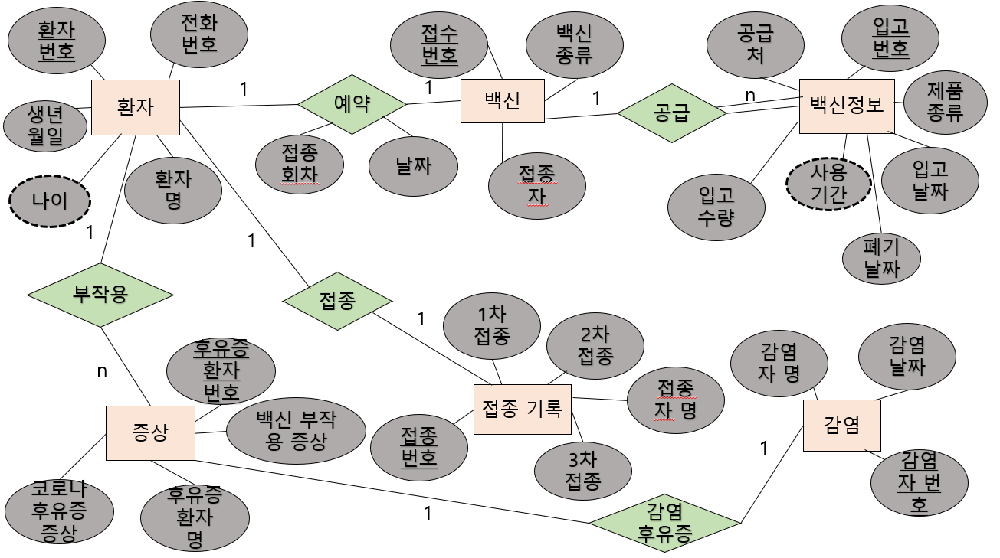

### 2022_DB_Project

### 프로젝트 주제
백신 접종 관리 

### 프로젝트 내용
사람들이 백신을 언제 접종하고, 어떤 종류를 접종하고, 몇 차까지 접종하고, 코로나 감염 여부가 있었는지 DB 시스템을 통해 정리하여 알려준다.

### 기능
* 사람들의 간단한 개인 정보 저장
* 사람 별 접종 여부 정보 제공
* 사람 별 코로나 감염 여부 제공
* 사람 별 접종 예약 날짜 정보 제공
* 사람 별 후유증 정보 제공
* 백신 용액에 대한 정보 제공

### E-R 다이어그램으로 표현

### 키
* 슈퍼키 - 
* 후보키 - 순서번호, (순서번호, 이름(닉네임)), (순서번호, 사람의 MBTI)
* 기본키 - 순서번호
* 대체키 - (순서번호, 이름(닉네임)), (순서번호, 사람의 MBTI)
* 외래키 - 사람의 MBTI
