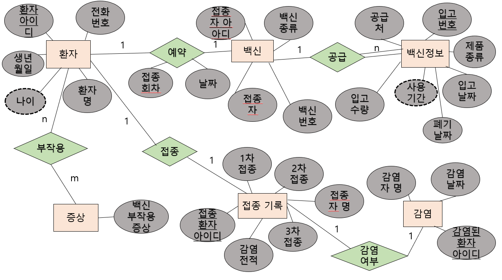

### 2022_DB_Project

### 프로젝트 주제
백신 접종 관리

### 프로젝트 내용
사람들이 백신을 언제 접종하고, 어떤 종류를 접종하고, 몇 차까지 접종하고, 코로나 감염 여부가 있었는지 DB 시스템을 통해 정리하여 알려준다.

### 기능
* 사람들의 간단한 개인 정보 저장
* 사람 별 접종 여부 정보 제공
* 사람 별 코로나 감염 여부 제공
* 사람 별 접종 예약 날짜 정보 제공
* 사람 별 후유증 정보 제공
* 백신 용액에 대한 정보 제공

### E-R 다이어그램으로 표현

### 키
* #### 슈퍼키
* 환자 릴레이션의 슈퍼키 : (환자아이디), (환자아이디, 전화번호), (환자아이디, 환자명)
* 백신 릴레이션의 슈퍼키 : (접종자아이디), (접종자아이디, 접종자), (백신번호), (접종자아이디, 백신번호)
* 백신 정보 릴레이션의 슈퍼키 : (입고번호), (입고번호, 입고날짜), (입고번호, 폐기날짜)
* 증상 릴레이션의 슈퍼키 : (백신부작용증상)
* 접종 기록 릴레이션의 슈퍼키 : (접종환자아이디), (접종환자아이디, 접종자명)
* 감염 릴레이션의 슈퍼키 : (감염된환자아이디), (감염된환자아이디, 감염자명)
* #### 후보키
* 환자 릴레이션의 후보키 : (환자아이디), (환자아이디, 전화번호)
* 백신 릴레이션의 후보키 : (접종자아이디)
* 백신 정보 릴레이션의 후보키 : (입고번호)
* 증상 릴레이션의 후보키 : (백신부작용증상)
* 접종 기록 릴레이션의 후보키 : (접종환자아이디)
* 감염 릴레이션의 후보키 : (감염된환자아이디)
* #### 기본키
* 환자 릴레이션의 기본키 : (환자아이디)
* 백신 릴레이션의 기본키 : (접종자아이디)
* 백신 정보 릴레이션의 기본키 : (입고번호)
* 증상 릴레이션의 기본키 : (백신부작용증상)
* 접종 기록 릴레이션의 기본키 : (접종환자아이디)
* 감염 릴레이션의 기본키 : (감염된환자아이디)
* #### 대체키
* 환자 릴레이션의 대체키 : (환자아이디, 전화번호)
* #### 외래키
* 백신 - (환자 릴레이션에서) 릴레이션의 외래키 : (접종아이디)
* 백신 - (백신정보 릴레이션에서) 릴레이션의 외래키 : (백신번호)
* 접종 기록 - (환자 릴레이션에서) 릴레이션의 외래키 : (접종환자아이디)
* 감염 - (환자 릴레이션에서) 릴레이션의 외래키 : (감염된환자아이디)

### 요구사항 명세서
##### * 개체는 굵게, 속성은 취소선으로 나타내었습니다.
1. 백신 접종을 하려면 __환자__ 는 ~~환자명~~, ~~환자아이디~~, ~~전화번호~~, ~~생년월일<~~, ~~나이~~를 입력해야 한다.
2. 환자는 환자아이디로 식별한다.
3.  __백신__ 에 대한 ~~접종자~~, ~~접종자아이디~~, ~~백신종류~~ 정보를 유지해야 한다.
4. 백신은 백신번호로 식별한다.
5.  __백신정보__ 에 대한 ~~공급처~~, ~~입고수량~~, ~~사용기간~~, ~~폐기날짜~~, ~~입고날짜~~, ~~제품종류~~, ~~입고번호~~ 정보를 유지해야 한다.
6. 백신정보는 입고번호로 식별한다.
7.  __증상__ 에 대한 ~~백신부작용증상~~ 정보를 유지해야 한다.
8.  __접종기록__ 에 대한 ~~1차접종~~, ~~2차접종~~, ~~3차접종~~, ~~접종자명~~, ~~접종환자아이디~~, ~~감염전적~~ 정보를 유지해야 한다.
9. 접종기록은 접종환자아이디로 식별한다.
10.  __감염__ 에 대한 ~~감염자명~~, ~~감염된환자아이디~~, ~~감염날짜~~ 정보를 유지해야 한다.
11. 감염은 감연된환자아이디로 식별한다.
12. 환자는 백신을 1차부터 3차까지 한번씩 접종해야 한다.
13. 여러 종류의 백신을 공급하지만 환자는 백신을 한 가지만 선택할 수 있다.
14. 환자는 부작용증상을 여러 개 선택할 수 있고 여러 증상을 여러 환자가 선택할 수 있다.
15. 환자 한 명 당 백신 종류 한 가지만 예약하여 접종할 수 있다.
16. 감염된 전적이 있는 환자는 접종 기록에 표시가 된다.

