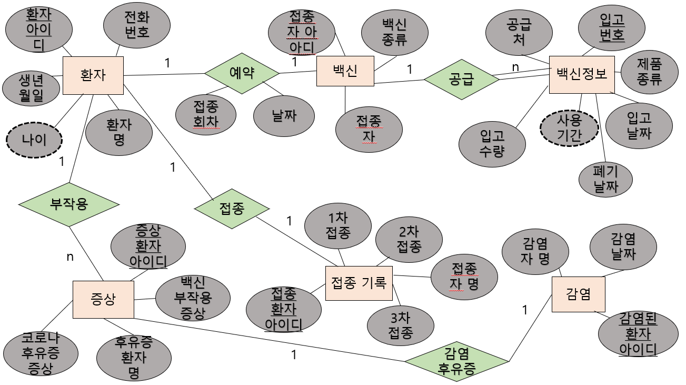

### 2022_DB_Project

### 프로젝트 주제
백신 접종 관리 

### 프로젝트 내용
사람들이 백신을 언제 접종하고, 어떤 종류를 접종하고, 몇 차까지 접종하고, 코로나 감염 여부가 있었는지 DB 시스템을 통해 정리하여 알려준다.

### 기능
* 사람들의 간단한 개인 정보 저장
* 사람 별 접종 여부 정보 제공
* 사람 별 코로나 감염 여부 제공
* 사람 별 접종 예약 날짜 정보 제공
* 사람 별 후유증 정보 제공
* 백신 용액에 대한 정보 제공

### E-R 다이어그램으로 표현

### 키
* 슈퍼키
환자 릴레이션의 슈퍼키 : (환자아이디), (환자아이디, 전화번호), (환자아이디, 환자명)
백신 릴레이션의 슈퍼키 : (접종자아이디), (접종자아이디, 접종자)
백신 정보 릴레이션의 슈퍼키 : (입고번호), (입고번호, 입고날짜), (입고번호, 폐기날짜)
증상 릴레이션의 슈퍼키 : (증상환자아이디), (증상환자아이디, 후유증환자명)
접종 기록 릴레이션의 슈퍼키 : (접종환자아이디), (접종환자아이디, 접종자명)
감염 릴레이션의 슈퍼키 : (감염된환자아이디), (감염된환자아이디, 감염자명)
* 후보키
환자 릴레이션의 후보키 : (환자아이디), (환자아이디, 전화번호)
백신 릴레이션의 후보키 : (접종자아이디)
백신 정보 릴레이션의 후보키 : (입고번호)
증상 릴레이션의 후보키 : (증상환자아이디)
접종 기록 릴레이션의 후보키 : (접종환자아이디)
감염 릴레이션의 후보키 : (감염된환자아이디)
* 기본키
환자 릴레이션의 기본키 : (환자아이디)
백신 릴레이션의 기본키 : (접종자아이디)
백신 정보 릴레이션의 기본키 : (입고번호)
증상 릴레이션의 기본키 : (증상환자아이디)
접종 기록 릴레이션의 기본키 : (접종환자아이디)
감염 릴레이션의 기본키 : (감염된환자아이디)
* 대체키
환자 릴레이션의 대체키 : (환자아이디, 전화번호)
* 외래키
백신 - 환자 릴레이션의 외래키 : (접종아이디)
증상 - 환자 릴레이션의 기본키 : (증상환자아이디)
접종 기록 - 환자 릴레이션의 기본키 : (접종환자아이디)
감염 - 환자 릴레이션의 외래키 : (감염된환자아이디)
