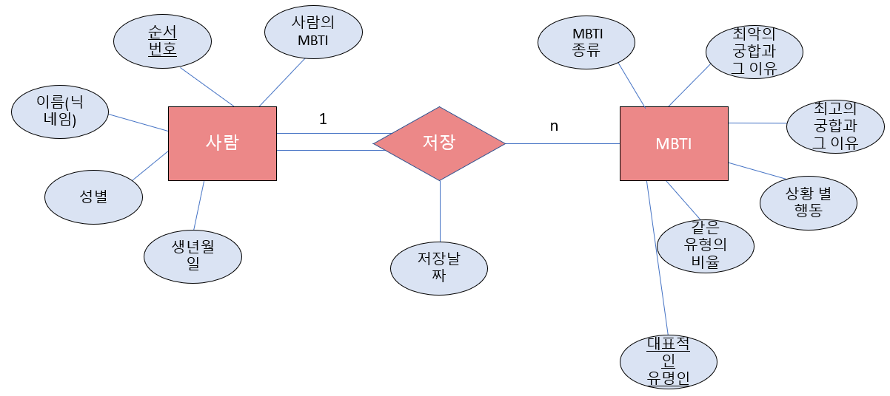

### 2022_DB_Project

### 프로젝트 주제 
사람들의 MBTI 유형 저장 및 여러 특징 알려주기

### 프로젝트 내용
사람들의 MBTI를 저장하고 저장된 MBTI 유형 별 여러 항목(상황)에 대한 특징(최고의 궁합, 최악의 궁합, 자신과 같은 유형인 사람의 비율, 대표적인 유명인, 어떤 상황에 대한 특징 등)을 알려준다.

### 기능
* 각 사람들의 MBTI 저장 
* 저장된 MBTI에 대한 여러 항목(상황) 별 정보를 제시

### E-R 다이어그램으로 표현

#### 키
* 슈퍼키 - 순서번호, (순서번호, 이름(닉네임)), (순서번호, 성별), (순서번호, 사람의 MBTI), (순서번호, 대표적인 유명인), (순서번호, 저장 날짜), (순서번호, 최고의 궁합 및 그 이유), (순서번호, 최악의 궁합 및 그 이유)
* 후보키 - 순서번호, (순서번호, 이름(닉네임)), (순서번호, 사람의 MBTI)
* 기본키 - 순서번호
* 대체키 - (순서번호, 이름(닉네임)), (순서번호, 사람의 MBTI)
* 외래키 - 사람의 MBTI
