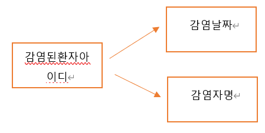
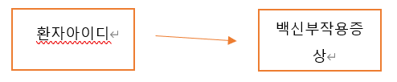
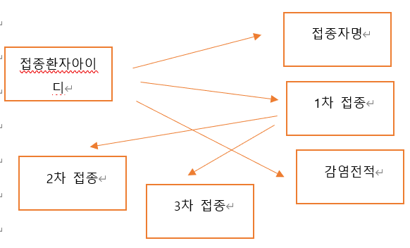
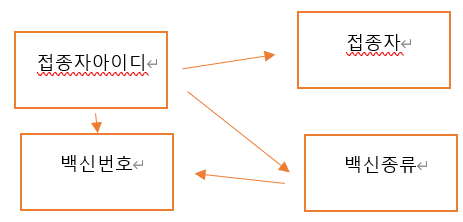
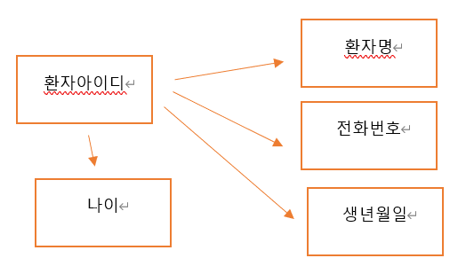
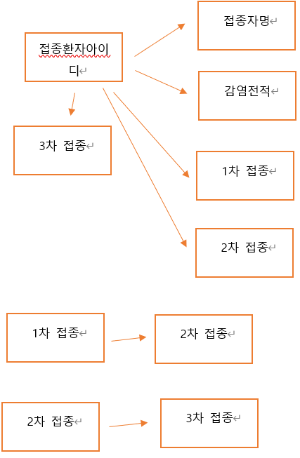
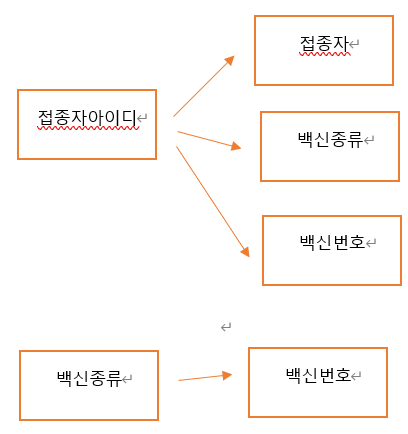
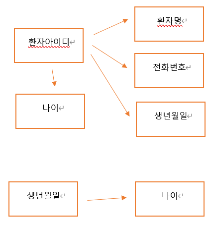
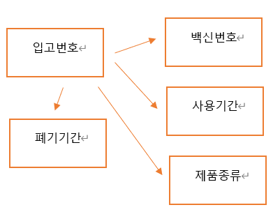

### 2022_DB_Project

### 1. 프로젝트 주제
백신 접종 관리      
    
### 2. 프로젝트 내용
사람들이 백신을 언제 접종하고, 어떤 종류를 접종하고, 몇 차까지 접종하고, 백신 부작용 증상이 있었는지, 코로나 감염 여부가 있었는지 DB 시스템을 통해 정리하여 알려준다.    
      
### 3. 기능
* 사람들의 간단한 개인 정보 저장
* 사람 별 접종 여부 정보 제공
* 사람 별 코로나 감염 여부 제공
* 사람 별 접종 예약 날짜 정보 제공
* 사람 별 후유증 정보 제공
* 백신 용액에 대한 정보 제공
    
### 4. E-R 다이어그램으로 표현

     
### 5. 키   
#### 슈퍼키
* 환자 릴레이션의 슈퍼키 : (환자아이디), (환자아이디, 전화번호), (환자아이디, 환자명)
* 백신 릴레이션의 슈퍼키 : (접종자아이디), (접종자아이디, 접종자), (백신번호), (접종자아이디, 백신번호)
* 백신 정보 릴레이션의 슈퍼키 : (입고번호), (입고번호, 입고날짜), (입고번호, 폐기날짜)
* 증상 릴레이션의 슈퍼키 : (백신부작용증상)
* 접종 기록 릴레이션의 슈퍼키 : (접종환자아이디), (접종환자아이디, 접종자명)
* 감염 릴레이션의 슈퍼키 : (감염된환자아이디), (감염된환자아이디, 감염자명)   
#### 후보키
* 환자 릴레이션의 후보키 : (환자아이디), (환자아이디, 전화번호)
* 백신 릴레이션의 후보키 : (접종자아이디)
* 백신 정보 릴레이션의 후보키 : (입고번호)
* 증상 릴레이션의 후보키 : (백신부작용증상)
* 접종 기록 릴레이션의 후보키 : (접종환자아이디)
* 감염 릴레이션의 후보키 : (감염된환자아이디)    
 #### 기본키
* 환자 릴레이션의 기본키 : (환자아이디)
* 백신 릴레이션의 기본키 : (접종자아이디)
* 백신 정보 릴레이션의 기본키 : (입고번호)
* 증상 릴레이션의 기본키 : (백신부작용증상)
* 접종 기록 릴레이션의 기본키 : (접종환자아이디)
* 감염 릴레이션의 기본키 : (감염된환자아이디)       
#### 대체키
* 환자 릴레이션의 대체키 : (환자아이디, 전화번호)       
 #### 외래키
* 백신 - (환자 릴레이션에서) 릴레이션의 외래키 : (접종아이디)
* 백신 - (백신정보 릴레이션에서) 릴레이션의 외래키 : (백신번호)
* 접종 기록 - (환자 릴레이션에서) 릴레이션의 외래키 : (접종환자아이디)
* 감염 - (환자 릴레이션에서) 릴레이션의 외래키 : (감염된환자아이디)    
              
### 6. 요구사항 명세서        
##### (개체는 __굵게__, 속성은 ~~취소선~~, 관계는 *이탤릭체*로 나타내었습니다.)
1. 백신 접종을 하려면 __환자__ 는 ~~환자명~~, ~~환자아이디~~, ~~전화번호~~, ~~생년월일~~, ~~나이~~를 입력해야 한다.
2. 환자는 환자아이디로 식별한다.
3.  __백신__ 에 대한 ~~접종자~~, ~~접종자아이디~~, ~~백신종류~~ 정보를 유지해야 한다.
4. 백신은 백신번호로 식별한다.
5.  __백신정보__ 에 대한 ~~사용기간~~, ~~폐기날짜~~, ~~제품종류~~, ~~입고번호~~ 정보를 유지해야 한다.
6. 백신정보는 입고번호로 식별한다.
7.  __증상__ 에 대한 ~~백신부작용증상~~ 정보를 유지해야 한다.
8.  __접종기록__ 에 대한 ~~1차접종~~, ~~2차접종~~, ~~3차접종~~, ~~접종자명~~, ~~접종환자아이디~~, ~~감염전적~~ 정보를 유지해야 한다.
9. 접종기록은 접종환자아이디로 식별한다.
10.  __감염__ 에 대한 ~~감염자명~~, ~~감염된환자아이디~~, ~~감염날짜~~ 정보를 유지해야 한다.
11. 감염은 감된환자아이디로 식별한다.
12. 환자는 백신을 맞을 경우 1차부터 3차까지 한번씩 접종해야 한다.
13. 각각 제품종류의 백신을 여러 개 *공급*하지만 백신은 한 가지만 접종할 수 있다.
14. 환자는 *부작용*을 여러 개 선택할 수 있고 하나의 백신부작용증상을 여러 환자가 선택할 수 있다.
15. 환자는 백신 종류 한 가지만 *예약*하여 접종할 수 있다.
16. 환자는 백신을 *접종*하면 접종 기록에 남고 접종 기록은 환자 한 명이 1차 접종할 때 마다 기록 하나가 생긴다.
17. 접종기록에서 감염전적은 감염되었을 때 *감염여부*에 따라 O라고 표시되고 감염되지 않았을 경우 X라고 표시된다. 
18. 환자가 백신을 예약하면 예약에 대한 접종회차, 날짜 정보를 유지해야한다.
19. 백신정보가 백신을 공급하면 공급처, 입고날짜, 입고수량 정보를 유지해야한다.
           
### 7. 릴레이션 스키마
##### (기본키는 ~~취소선~~으로 나타냈습니다.)
|릴레이션 이름|속성이름|속성이름|속성이름|속성이름|속성이름|속성이름|속성이름|
|:---:|:---:|:---:|:---:|:---:|:---:|:---:|:---:|
|접종기록 릴레이션|~~접종환자아이디~~|접종자명|1차접종|2차접종|3차접종|감염전적|~~감염된환자아이디~~(외래키)|
|부작용 릴레이션|~~환자아이디~~(외래키)|~~백신부작용증상~~(외래키)|
|감염 릴레이션|~~감염된환자아이디~~|감염자명|감염날짜|
|증상 릴레이션|~~백신부작용증상~~|
|백신 릴레이션|~~접종자아이디~~|백신종류|접종자|백신번호|~~환자아이디~~(외래키)|
|백신정보 릴레이션|~~입고번호~~|제품종류|사용기간|폐기날짜|~~백신번호~~(외래키)|
       
### 8. 물리적 스키마   
##### 감염 테이블   
감염된환자아이디 VARCHAR(20), 널 값 허용 X, PK,   
감염자명 VARCHAR(10), 널 값 허용 X   
감염날짜 DATE, 널 값 허용 X   
   
##### 부작용 테이블   
환자아이디 VARCHAR(20), 널 값 허용 X, PK, FK   
백신부작용증상 VARCHAR(50), 널 값 허용 X, PK, FK   
   
##### 접종기록 테이블   
접종환자아이디 VARCHAR(20), 널 값 허용 X, PK   
접종자명 VARCHAR(10), 널 값 허용 X   
1차접종 VARCHAR(5), 널 값 허용   
2차접종 VARCHAR(5), 널 값 허용   
3차접종 VARCHAR(5), 널 값 허용   
감염전적 VARCHAR(5), 널 값 허용   
감염된환자아이디 VARCHAR(20), 널 값 허용 X, FK   
   
##### 증상 테이블   
백신부작용증상 VARCHAR(50), 널 값 허용 X, PK   
   
##### 백신 테이블   
접종자아이디 VARCHAR(20), 널 값 허용 X, PK   
백신종류 VARCHAR(10), 널 값 허용 X   
접종자 VARCHAR(10), 널 값 허용 X   
백신번호 INT, 널 값 허용 X    
환자아이디 VARCHAR(20), 널 값 허용 X, FK   
   
##### 환자 테이블   
환자아이디 VARCHAR(20), 널 값 허용 X, PK   
환자명 VARCHAR(20), 널 값 허용 X, PK   
생년월일 DATE   
나이 INT   
전화번호 VARCHAR(10), 널 값 허용   
접종환자아이디 VARCHAR(20), 널 값 허용 X, FK   
   
##### 백신정보 테이블   
입고번호 INT, 널 값 허용 X, PK    
제품종류 VARCHAR(10), 널 값 허용 X    
사용기간 DATE     
폐기날짜 DATE    
백신번호 INT, 널 값 허용 X, FK    
      
### 9. DB 테이블 생성 스크립트    
    
CREATE TABLE __감염__ (    
감염된환자아이디 VARCHAR(20) NOT NULL.    
감염자명 VARCHAR(10) NOT NULL,    
감염날짜 DATE     
PRIMARY KEY(감염된환자아이디)     
);    
    
CREATE TABLE __부작용__ (     
환자아이디 VARCHAR(20) NOT NULL,    
백신부작용증상 VARCHAR(50) NOT NULL,
PRIMARY KEY(백신부작용증상),    
FOREIGN KEY(환자아이디) REFERNECES 환자(환자아이디),     
FOREIGN KEY(백신부작용증상) REFERENCES 증상(백신부작용증상)     
);    
CREATE TABLE __접종기록__ (      
접종환자아이디 VARCHAR(20) NOT NULL,       
접종자명 VARCHAR(10) NOT NULL,      
1차접종 VARCHAR(5) NOT NULL,       
2차접종 VARCHAR(5) NOT NULL,          
3차접종 VARCHAR(5) NOT NULL,        
감염전적 VARCHAR(5) NOT NULL,      
PRIMARY KEY(접종환자아이디),      
FOREIGN KEY(접종환자아이디) REFERENCES 감염(감염된환자아이디)     
);    
       
CREATE TABLE __증상__ (       
백신부작용증상 VARCHAR(50) NOT NULL,        
PRIMARY KEY (백신부작용증상)       
);       
       
CREATE TABLE __백신__ (       
접종자아이디 VARCHAR(20) NOT NULL,           
백신종류 VARCHAR(10) NOT NULL,       
접종자 VARCHAR(10) NOT NULL,    
백신번호 INT UNIQUE,           
PRIMARY KEY(접종자아이디),         
FOREIGN KEY(접종자아이디) REFERENCES 환자(환자아이디)         
);        
          
CREATE TABLE __환자__ (        
환자아이디 VARCHAR(20) NOT NULL,             
환자명 VARCHAR(20) NOT NULL,        
생년월일 DATE,        
나이 INT,         
전화번호 VARCHAR(10),             
PRIMARY KEY(환자아이디),             
FOREIGN KEY(환자아이디) REFERENCES 접종기록(접종환자아이디),                
CHECK (나이 >= 0)           
);           
          
CREATE TABLE __백신정보__ (           
입고번호 INT,            
제품종류 VARCHAR(10) NOT NULL,             
사용기간 DATE,         
폐기기간 DATE,            
백신아이디 INT,          
PRIMARY KEY(입고번호),        
FOREIGN KEY(백신아이디) REFERENCES 백신(백신번호)          
);     

### 정규화

##### 제 1 정규화

###### 감염 릴레이션       
감염된환자아이디 → 감염날짜        
감염된환자아이디 → 감염자명             

따라서 부분 함수 종속이 아니기 때문에 삭제 이상이 일어나지 않는다.       
감염된환자아이디와 감염자명은 NOT NULL이기 때문에 삽입 이상이 발생하지 않는다.          
중복 데이터가 발생하여 갱신 이상이 일어날 수 있다.           
               

###### 부작용 릴레이션   
환자아이디 → 백신부작용증상    

따라서 부분 함수 종속이 아니기 때문에 삭제 이상이 일어나지 않는다.   
환자아이디와 백신부작용증상은 NOT NULL이기 때문에 삽입 이상이 발생하지 않는다.        
백신부작용 증상은 여러 가지로 나타날 수 있기에 갱신 이상과 관련이 없다.         
 

###### 접종기록 릴레이션
접종환자아이디 → 접종자명          
접종환자아이디 → 감염전적         
접종환자아이디 → 1차 접종         
접종환자아이디 → 2차 접종         
접종환자아이디 → 3차 접종         
1차 접종 → 2차 접종        
2차 접종 → 3차 접종         

따라서 부분 함수 종속이 아니기 때문에 삭제 이상이 일어나지 않는다.          
각각 속성들이 NOT NULL이기 때문에 삽입 이상이 발생하지 않는다.           
중복 데이터가 발생하여 갱신 이상이 일어날 수 있다.       
 

###### 증상 릴레이션
백신부작용 증상이라는 하나의 속성만 존재하기 때문에 이상 현상이 발생하지 않는다.       

###### 백신 릴레이션                      
접종자아이디 → 접종자          
접종자아이디 → 백신종류          
접종자아이디 → 백신번호       
백신종류 → 백신번호          

따라서 부분 함수 종속이 아니기 때문에 삭제 이상이 일어나지 않는다.             
각각 속성들이 NOT NULL이기 때문에 삽입 이상이 발생하지 않는다.             
중복 데이터가 발생하여 갱신 이상이 일어날 수 있다.        
 

###### 환자 릴레이션
환자아이디 → 환자명            
환자아이디 → 전화번호        
환자아이디 → 생년월일           
환자아이디 → 나이            
생년월일 → 나이           

따라서 부분 함수 종속이 아니기 때문에 삭제 이상이 일어나지 않는다.         
나이를 제외하곤 속성들이 NOT NULL이기 때문에 삽입 이상이 발생하지 않는다.        
중복 데이터가 발생하여 갱신 이상이 일어날 수 있다.         
 

###### 백신정보 릴레이션            
입고번호 → 제품종류          
입고번호 → 백신번호           
입고번호 → 사용기간           
입고번호 → 폐기기간          
사용기간 → 폐기기간            
백신번호 → 제품종류     

따라서 부분 함수 종속이 아니기 때문에 삭제 이상이 일어나지 않는다.            
백신 번호가 NOT NULL이기 때문에 삽입 이상이 발생하지 않는다.           
중복 데이터가 발생하여 갱신 이상이 일어날 수 있다.           
 

##### 제 2 정규화         

###### 감염 릴레이션
종속 관계에는 문제가 없다.         
기본키는 NOT NULL이므로 삽입 이상이 발생할 수 없다.           
감염날짜 별로 감염된환자아이디가 다르기 때문에 갱신 이상에 영향을 미치지 않는다.          
투플을 삭제하더라도 대한 연계된 정보의 투플이 없으므로 삭제 이상에 영향을 미치지 않는다.                   
###### 부작용 릴레이션        
종속 관계에는 문제가 없다.            
기본키는 NOT NULL이므로 삽입 이상이 발생할 수 없다.           
투플을 삭제하더라도 대한 연계된 정보의 투플이 없으므로 삭제 이상에 영향을 미치지 않는다.            
백신부작용증상이 환자아이디 마다 다르기 때문에 갱신 이상에 영향을 미치지 않는다.                         
###### 접종기록 릴레이션          
종속 관계에는 문제가 없다.                              
기본키는 NOT NULL이므로 삽입 이상이 발생할 수 없다.                                   
접종기록의 투플을 삭제하더라도 감염전적이 감염전적 테이블에 남아있기 때문에 삭제 이상이 발생하지 않는다.                  
접종환자아이디 마다 접종 횟수와 감염 전적이 다르기 때문에 갱신 이상에 영향을 미치지 않는다.             

###### 증상 릴레이션                
종속 관계에는 문제가 없다.                              
기본키는 NOT NULL이므로 삽입 이상이 발생할 수 없다.                            
백신부작용증상의 종류가 연관되는 것 없이 다양하기 때문에 갱신 이상에 영향을 미치지 않는다.                  
투플을 삭제하더라도 대한 연계된 정보의 투플이 없으므로 삭제 이상에 영향을 미치지 않는다.                           
  
###### 백신 릴레이션         
종속 관계에는 문제가 없다.                              
기본키는 NOT NULL이므로 삽입 이상이 발생할 수 없다.                       
백신 번호나 백신 종류가 변경되면 변경되지 않고 기존의 백신 번호나 백신 종류를 사용하고 있는 속성 값이 존재할 수 있다.                      
투플을 삭제하더라도 대한 연계된 정보의 투플이 없으므로 삭제 이상에 영향을 미치지 않는다.                    

###### 환자 릴레이션                      
종속 관계에는 문제가 없다.                    
기본키는 NOT NULL이므로 삽입 이상이 발생할 수 없다.                         
투플이 변경되더라도 다른 투플들과 데이터가 관련이 없으므로 갱신 이상에 영향을 미치지 않는다.                        
투플을 삭제하더라도 대한 연계된 정보의 투플이 없으므로 삭제 이상에 영향을 미치지 않는다.                  

###### 백신정보 릴레이션                  
종속 관계에는 문제가 없다.                        
백신 아이디나 백신 종류가 변경되면 변경되지 않고 기존의 백신 아이디나 백신 종류를 사용하고 있는 속성 값이 존재할 수 있다.                      
기본키는 NOT NULL이므로 삽입 이상이 발생할 수 없다.                        
투플을 삭제하더라도 대한 연계된 정보의 투플이 없으므로 삭제 이상에 영향을 미치지 않는다.            

##### 제 3 정규화
제 3 정규화를 만족하도록 제 1정규화에서의 이행적 함수 종속 다이어그램을 함수 종속 다이어그램으로 나누었다.       

###### 접종기록 릴레이션
 

###### 백신 릴레이션
 

###### 환자 릴레이션
 

###### 백신정보 릴레이션
 

##### BCNF

###### 감염 릴레이션             
이지영이라는 감염자가 2022-05-24에 감염되었어도 감염된환자아이디가 NULL이면 감염 릴레이션에 삽입할 수 없다.                                       
한 아이디에 감염자가 이름이 중복되면 안된다. 한 감염자가 한 아이디를 사용해야 한다는 전제 조건에 모순되는 문제가 발생한다.                            

###### 부작용 릴레이션
부작용 증상들을 입력했지만 환자아이디가 NULL이면 부작용 릴레이션에 삽입할 수 없다.                              

###### 접종기록 릴레이션
접종자명, 1차접종, 2차접종, 3차접종, 감염전적을 입력했지만 접종환자아이디가 NULL이면 접종기록 릴레이션에 삽입할 수 없다.                        

###### 백신 릴레이션
백신종류, 접종자, 백신번호를 입력했지만 접종자아이디가 NULL이면 백신 릴레이션에 삽입할 수 없다.                          
백신번호와 백신종류가 다른 것으로 중복해서 삽입되면 안된다. 환자는 하나의 백신종류를 맞아야한다는 전제 조건에 모순되기 때문이다.         

###### 환자 릴레이션
환자명, 생년월일, 나이, 전화번호를 입력했지만 환자아이디가 NULL이면 환자 릴레이션에 삽입할 수 없다.                             
한 환자아이디에 여러 환자명의 투플이 삽입되면 안된다. 한 환자아이디는 한 환자만 사용해야한다는 전제 조건에 모순되기 때문이다.  

###### 백신정보 릴레이션                           
제품종류, 사용기간, 폐기기간, 백신아이디를 입력했지만 입고번호가 NULL이면 백신정보 릴레이션에 삽입할 수 없다.                    
제품종류나 백신아이디가 맞지 않게 삽입되면 안된다. 하나의 백신종류는 겹치지 않는 백신아이디를 갖고 있다는 전제조건에 모순되기 때문이다.                      
백신정보의 투플이 삭제되면 현재 어떤 백신 종류가 얼마나 남았고 얼마 동안 사용 가능한지 정보를 모르기 때문에 삭제하면 안된다. 따라서 두 개의 릴레이션으로 분해해야 한다. 

백신아이디 → 입고번호          
입고번호 → 사용기간        

